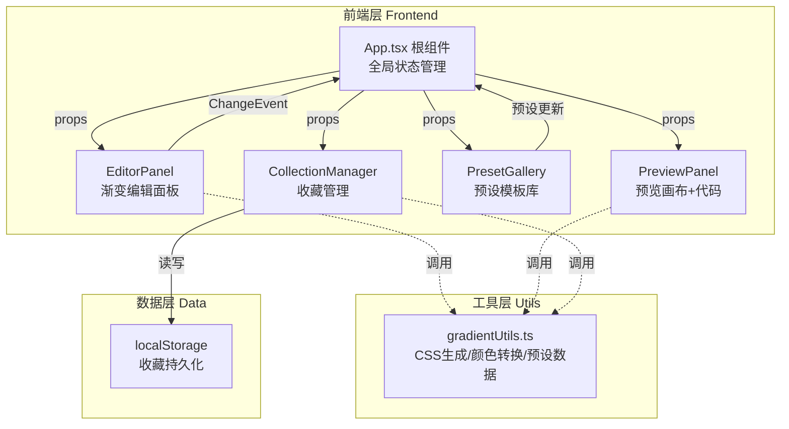

# CSS 渐变构建器 - 技术架构文档

## 1. 架构设计

采用单页应用（SPA）架构，前端纯静态，数据存储于浏览器 localStorage，无后端服务。遵循 React 单向数据流，App 根组件管理全局状态，子组件通过 props 接收数据、通过回调函数向上发送事件。



## 2. 技术说明

- **前端框架**：React@18.2.0 + react-dom@18.2.0
- **构建工具**：Vite + @vitejs/plugin-react
- **语言**：TypeScript（严格模式，jsx: react-jsx）
- **初始化工具**：Vite
- **后端**：无（纯前端应用）
- **数据库**：无，使用浏览器 localStorage 持久化收藏数据

### 依赖清单

```json
{
  "react": "18.2.0",
  "react-dom": "18.2.0",
  "@types/react": "latest",
  "@types/react-dom": "latest",
  "typescript": "latest",
  "vite": "latest",
  "@vitejs/plugin-react": "latest"
}
```

## 3. 文件结构与职责定义

| 文件 | 职责 |
|------|------|
| `package.json` | 依赖声明、启动脚本 `dev: vite` |
| `vite.config.js` | 配置 React 插件 |
| `tsconfig.json` | TypeScript 严格模式、jsx: react-jsx |
| `index.html` | 入口页面，引入 root div |
| `src/App.tsx` | 根组件，管理全局状态，单向数据流协调各模块 |
| `src/components/EditorPanel.tsx` | 渐变编辑面板：类型选择、角度滑块、颜色节点列表，输出 ChangeEvent |
| `src/components/PreviewPanel.tsx` | 渐变预览画布，实时根据 props 渲染，显示 CSS 代码与复制按钮 |
| `src/components/PresetGallery.tsx` | 预设模板组件，从内置数据加载，选中后发送预设更新 |
| `src/components/CollectionManager.tsx` | 收藏管理：localStorage 读写、列表展示、删除、导出 |
| `src/utils/gradientUtils.ts` | 工具模块：生成 CSS 字符串、颜色转换（hex/rgb/hsl 互转）、预设数据定义 |

## 4. 数据模型

### 4.1 核心类型定义

```typescript
// 渐变类型
type GradientType = 'linear' | 'radial';

// 颜色节点
interface ColorStop {
  id: string;
  position: number;   // 0-100 百分比
  color: string;      // hex 格式存储
}

// 渐变配置
interface GradientConfig {
  type: GradientType;
  angle: number;        // 0-360 度（线性渐变使用）
  stops: ColorStop[];   // 颜色节点数组，至少4个
}

// 收藏方案
interface SavedGradient {
  id: string;
  name: string;
  config: GradientConfig;
  createdAt: number;
}

// 预设模板
interface PresetGradient {
  id: string;
  name: string;
  style: string;        // 风格标签
  config: GradientConfig;
}
```

### 4.2 数据存储

- **localStorage Key**：`gradient_collection`
- **存储格式**：JSON 序列化的 `SavedGradient[]` 数组
- **读写策略**：CollectionManager 组件负责所有 localStorage 读写，采用 try-catch 容错

## 5. 数据流说明

单向数据流，所有状态由 App.tsx 集中管理：

1. **编辑更新**：EditorPanel 通过 `onChange(config: GradientConfig)` 回调向上传递 → App 更新 state → 下发到 PreviewPanel
2. **预设加载**：PresetGallery 通过 `onSelect(preset: PresetGradient)` 回调 → App 更新 state → 同步到 EditorPanel 与 PreviewPanel
3. **收藏保存**：CollectionManager 通过 `onSave(config, name)` 读取当前 App 传入的 config → 写入 localStorage → 刷新列表
4. **收藏编辑/删除/导出**：CollectionManager 内部处理，通过 `onEdit`、`onDelete` 回调与 App 同步当前编辑配置

## 6. 工具模块接口（gradientUtils.ts）

```typescript
// 生成 CSS 渐变字符串
generateGradientCSS(config: GradientConfig): string;

// 颜色转换：hex → rgb
hexToRgb(hex: string): { r: number; g: number; b: number };
// 颜色转换：rgb → hex
rgbToHex(r: number, g: number, b: number): string;
// 颜色转换：rgb → hsl
rgbToHsl(r: number, g: number, b: number): { h: number; s: number; l: number };
// 颜色转换：hsl → rgb
hslToRgb(h: number, s: number, l: number): { r: number; g: number; b: number };
// 颜色转换：hsl → hex
hslToHex(h: number, s: number, l: number): string;
// 颜色转换：hex → hsl
hexToHsl(hex: string): { h: number; s: number; l: number };

// 预设模板数据
const PRESETS: PresetGradient[];
```

## 7. 性能保障策略

- **预览更新延迟 ≤50ms**：使用 React 受控组件 + useCallback 优化渲染，颜色节点拖拽使用本地状态实时反馈，避免频繁触发完整重渲染
- **收藏列表渲染 ≤200ms**：列表项使用 React.memo 优化，避免不必要重渲染；localStorage 读取采用惰性加载 + 防抖
- **CSS 过渡统一**：所有颜色变化与面板切换统一 `transition: 0.3s ease`
