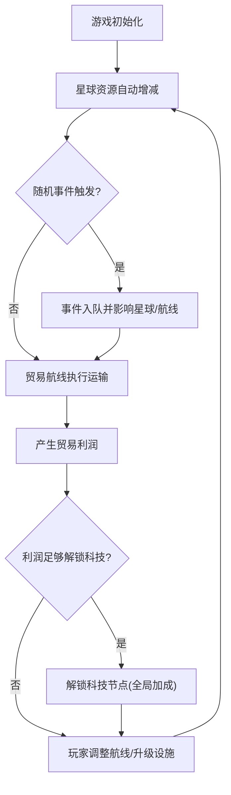

# 星际贸易路线策略游戏 — 产品需求文档（PRD）

## 1. 产品概述

一款以宇宙星球间贸易为核心的策略模拟游戏。玩家在动态资源、贸易路线与随机事件的约束下进行决策，通过升级设施、规划双向航线、解锁科技节点来扩大星际贸易帝国。

- 主要目的：模拟多星球资源生产—运输—消费闭环，考验玩家在动态事件下的策略决策能力。
- 目标用户：策略/模拟经营类游戏爱好者、对资源调度与运筹感兴趣的玩家。
- 价值：以轻量化 Canvas2D 实现高表现力的星际网络可视化与实时反馈，兼顾策略深度与运行性能。

## 2. 核心功能

### 2.1 玩家角色
| 角色 | 说明 | 核心权限 |
|------|------|----------|
| 指挥官（玩家） | 默认唯一角色 | 升级星球设施、建立/调整贸易路线、解锁科技、应对随机事件 |

### 2.2 功能模块
1. **顶部资源总览栏**：聚合展示全星球金属/能源/食物总量、贸易利润、科技点、FPS 与事件计数。
2. **中部星球网络可视化**：Canvas2D 渲染星球网络、SVG 贝塞尔贸易航线与流动粒子，支持点击星球交互。
3. **底部事件日志区域**：滚动展示历史事件、当前激活事件及处理建议。
4. **侧边控制面板**：星球详情、设施升级、建立航线、科技树解锁。

### 2.3 页面详情
| 区域 | 模块 | 功能描述 |
|------|------|----------|
| 顶部栏 | 资源总览 | 实时聚合金属/能源/食物总量、利润、科技点、FPS、事件数；色块随存量变化 |
| 中部 | 星球网络 | CSS 渐变圆环表示资源状态；点击选中星球；拖拽建立航线；粒子流动动画 |
| 中部 | 贸易航线 | SVG 贝塞尔曲线连接星球，容量/运输进度可视化，粒子沿曲线流动 |
| 底部 | 事件日志 | 事件触发记录、影响说明、处理提示；页面边缘闪烁警告条 |
| 侧边 | 控制面板 | 星球详情、设施升级按钮、航线容量调整、科技树节点解锁 |

## 3. 核心流程

玩家初始化获得数个星球，每个星球具备初始资源与产量。模拟周期内资源自动增减；玩家在星球间建立双向贸易航线，航线按容量与运输时间自动交换资源。模拟过程中随机触发事件（海盗、资源短缺、科技突破），影响产量或运输效率，玩家手动调整航线应对。贸易产生利润积累科技点，解锁科技节点获得全局加成，形成正反馈循环。

## 4. 用户界面设计

### 4.1 设计风格
- 主色：深空蓝紫色调（如 `#0a0a1f` 深空底 + `#6366f1`/`#8b5cf6` 紫蓝高光 + 青色 `#22d3ee` 能量点缀）。
- 星球：CSS 渐变圆环，颜色随资源存量实时变化（金属偏钢银、能源偏青蓝、食物偏翠绿）。
- 贸易航线：SVG 贝塞尔曲线 + 沿曲线流动的粒子动画。
- 事件警告：页面边缘出现闪烁警告条（红色/琥珀色脉冲）。
- 字体：科幻感显示字体（如 Orbitron 标题）+ 等宽数字字体用于资源数值。
- 布局：顶部资源总览栏 + 中部星球网络可视化 + 底部事件日志区域，1920×1080 全屏适配。

### 4.2 页面设计概览
| 区域 | 模块 | UI 元素 |
|------|------|---------|
| 顶部栏 | 资源总览 | 玻璃态卡片、渐变图标、实时数字滚动、FPS 指示 |
| 中部 | 星球网络 | 深空背景星空、CSS 渐变圆环星球、SVG 贝塞尔航线、流动粒子、选中高亮 |
| 底部 | 事件日志 | 深色滚动列表、事件类型色标、时间戳、边缘闪烁警告条 |
| 侧边 | 控制面板 | 星球详情卡、升级按钮、科技树节点连线图 |

### 4.3 响应式
桌面优先，目标 1920×1080 全屏适配；中部 Canvas 自适应容器尺寸并保持 DPR 清晰；较小屏幕下保持三段式布局不塌陷。

## 5. 性能要求
- 所有动画（粒子流动、资源增量变化）维持 ≥ 30 FPS。
- 事件队列处理延迟 ≤ 100ms。
- Canvas 渲染使用 requestAnimationFrame，星球/粒子数量受控以保证帧率。

## 6. 运行方式
`npm install && npm run dev`，打开浏览器即可看到星球网络并交互；`npm run build` 进行类型检查与生产构建。
