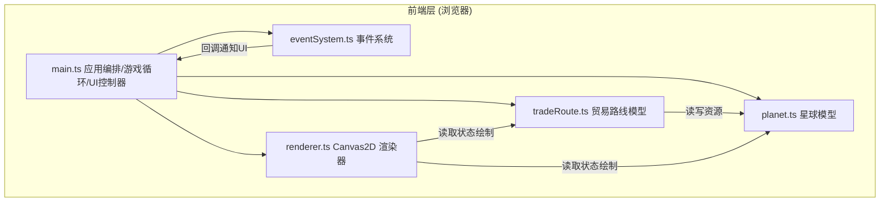
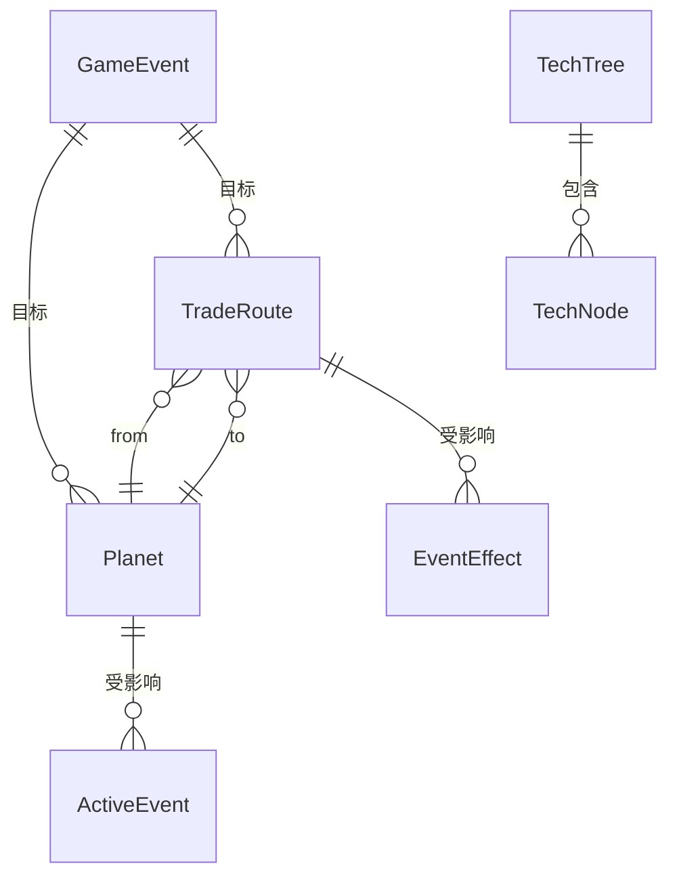

# 星际贸易路线策略游戏 — 技术架构文档

## 1. 架构设计

纯前端架构，无后端服务。采用 TypeScript + Vite + Canvas2D，避免 Three.js 的复杂性。模块化分层：游戏数据模型层（Planet/TradeRoute/TechTree）、事件系统层（EventSystem）、渲染层（Renderer）、应用编排层（main）。



## 2. 技术说明
- 前端：TypeScript（严格模式，target ES2020，module ESNext）+ Vite + Canvas2D。
- 构建工具：Vite（入口 index.html，启用严格 TS 插件）。
- 依赖：`typescript`、`vite`、`vite-plugin`（@vitejs/plugin-vite 或 TS 插件，按 vite 官方 vanilla-ts 惯例）。仅必要依赖，不引入 React/Vue。
- 后端：无（纯前端模拟）。
- 数据：内存运行时状态，无数据库。

## 3. 文件结构与职责
| 文件 | 职责 |
|------|------|
| `package.json` | 依赖（typescript、vite）、脚本（dev: vite、build: tsc && vite build） |
| `vite.config.js` | Vite 配置，入口 index.html，启用严格模式 TS 插件 |
| `tsconfig.json` | 严格模式，target ES2020，module ESNext |
| `index.html` | 页面入口，加载 src/main.ts，含 `#app` 容器 |
| `src/main.ts` | 初始化星球、贸易网络、UI 控制器、科技树，启动游戏循环 |
| `src/planet.ts` | 星球类：资源存量、产量、设施等级、事件状态；update 资源、升级设施 |
| `src/tradeRoute.ts` | 贸易路线类：起终点、容量、运输进度、事件影响；执行运输、调整容量 |
| `src/eventSystem.ts` | 事件系统：事件队列、触发条件、处理逻辑，与 UI 通过回调交互 |
| `src/renderer.ts` | Canvas 渲染器：绘制星球、路线粒子、事件警告，requestAnimationFrame 循环优化 |

## 4. 数据模型

### 4.1 核心类型定义

```typescript
type ResourceType = 'metal' | 'energy' | 'food';

interface ResourceState { metal: number; energy: number; food: number; }

// 星球
class Planet {
  id: string; name: string;
  position: { x: number; y: number };
  resources: ResourceState;          // 当前存量
  production: ResourceState;         // 每周期产量
  facilityLevel: number;             // 生产设施等级
  activeEvents: ActiveEvent[];       // 影响该星球的事件
  owned: boolean;                    // 玩家是否拥有
  update(dt: number): void;          // 资源自动增减（受事件影响）
  upgradeFacility(): boolean;        // 升级设施，提升产量
}

// 贸易路线
class TradeRoute {
  id: string; from: Planet; to: Planet;
  capacity: number;                  // 单次运输容量
  transitTime: number;               // 运输时间（秒）
  progress: number;                  // 当前运输进度 0..1
  payload: Partial<ResourceState>;   // 在途资源
  eventEffects: EventEffect[];       // 事件影响（减速等）
  executeTransport(dt: number): void;// 推进进度，到点交换资源
  adjustCapacity(value: number): void;
}

// 事件
interface GameEvent {
  id: string; type: 'pirates' | 'shortage' | 'breakthrough';
  targetPlanetId?: string; targetRouteId?: string;
  duration: number; severity: number;
  description: string;
}
```

### 4.2 数据模型关系



## 5. 科技树（固定树状结构，≥5 节点）
固定树状结构，按利润积累的科技点逐级解锁，提供全局加成：
1. **节点 A · 引擎强化**：运输速度 +20%（前置：无）
2. **节点 B · 深空采矿**：金属产量 +50%（前置：无）
3. **节点 C · 聚变反应**：能源产量 +50%（前置：A）
4. **节点 D · 基因农业**：食物产量 +50%（前置：A）
5. **节点 E · 量子物流**：贸易航线容量 +1，利润 +30%（前置：C、D）

## 6. 性能优化策略
- 渲染：单 `requestAnimationFrame` 主循环，dt 驱动；星空背景离屏缓存；粒子数量上限。
- 事件队列：固定容量环形缓冲，处理优先级排序，保证 ≤100ms 处理延迟。
- 资源更新：基于 dt 的累积计算，避免每帧全量重算。
- Canvas：按 devicePixelRatio 缩放保证清晰，脏区域受控重绘。
- 帧率监控：实时计算 FPS 显示于顶部栏，低于阈值时自动降级粒子密度。

## 7. 构建与运行
- 安装：`npm install`
- 开发：`npm run dev`（Vite dev server）
- 构建：`npm run build`（`tsc && vite build`）
- 产物：`dist/`
